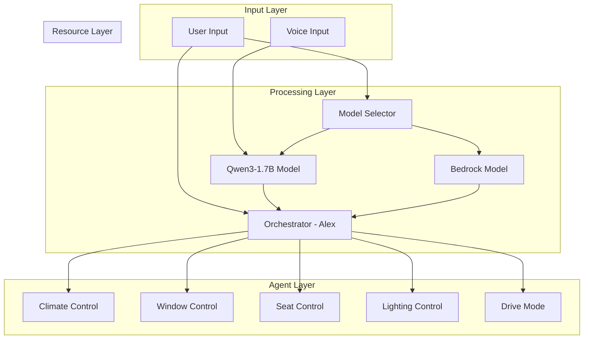
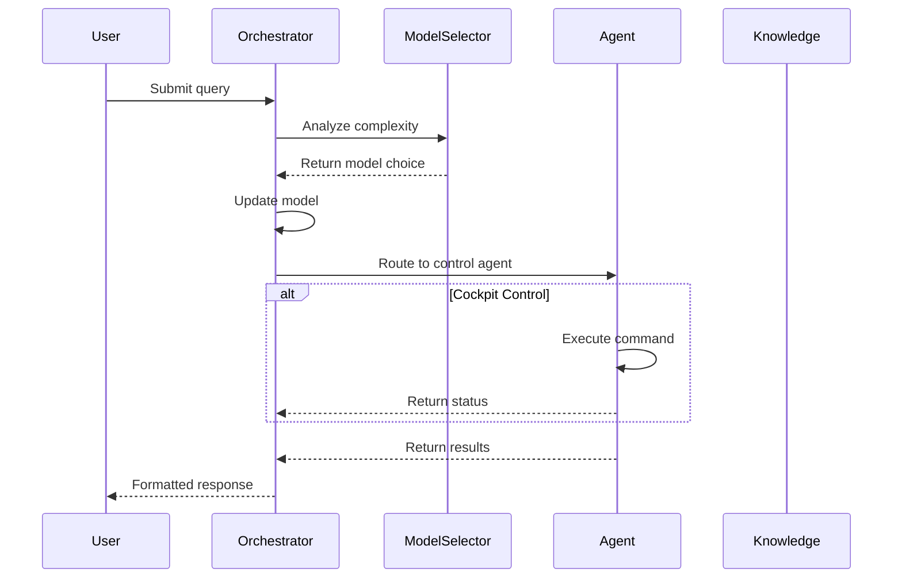
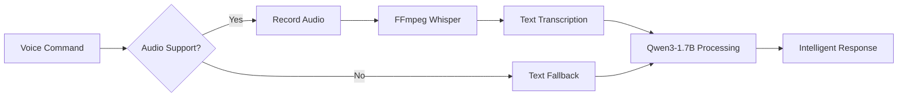
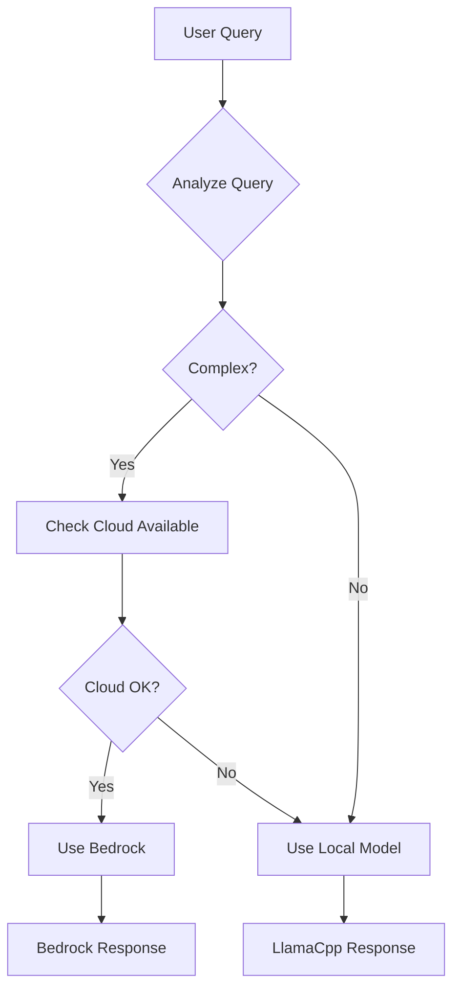

# Agentic AI at the Edge

An intelligent cockpit control system designed for edge deployment in vehicles, featuring voice input powered by FFmpeg-Whisper integration, dynamic model routing with Qwen3-1.7B from  **Hugging Face**, and specialized agents for vehicle controls.

## Overview

This project demonstrates a **unified codebase architecture** that seamlessly runs across development, container, and production service environments without modification. The same `main.py` adapts its behavior based on deployment context, showcasing true write-once, deploy-anywhere capabilities.


### Core Features
- **Advanced AI reasoning** powered by Qwen3-1.7B with thinking/non-thinking mode capabilities
- **Voice-enabled processing** with FFmpeg-Whisper integration for optimal transcription
- **Cockpit controls** for climate, windows, seats, lights, and drive modes
- **Dynamic model routing** between local Qwen3 and cloud models based on query complexity  
- **Multilingual support** for 100+ languages with superior instruction following
- **Deployment-aware configuration** that automatically adapts to environment
- **Zero code changes** required between development and production

## Architecture

### System Overview



### Request Flow Sequence



### Voice Processing Flow



## Deployment Modes

### 1. Development Mode
Direct execution on developer machine with full capabilities:
```bash
python main.py
```
- **Audio**: Direct microphone access via sounddevice
- **Models**: Dynamic selection between local/cloud
- **Interface**: Rich terminal UI with color output
- **Use Case**: Development, testing, demonstrations

### 2. Container Mode  
Dockerized deployment for edge devices:
```bash
docker run -v $(pwd)/audio_exchange:/app/audio_exchange agentic-ai-edge
```
- **Audio**: File-based exchange through volume mount
- **Models**: Prioritizes local models for offline operation
- **Interface**: Terminal interface inside container
- **Use Case**: Edge devices, automotive systems, IoT

### 3. Service/API Mode
RESTful service for integration:
```bash
ENABLE_API=true python main.py
# or
docker run -e ENABLE_API=true -p 8000:8000 agentic-ai-edge
```
- **Audio**: Base64-encoded in JSON payload
- **Models**: Deployment-aware selection
- **Interface**: HTTP REST API with session support
- **Use Case**: Android Auto, web services, microservices

## Quick Start

### Prerequisites

1. Python 3.8 or higher
2. Strands SDK: `pip install git+https://github.com/westonbrown/sdk-python.git@main`
3. llama.cpp with server support
4. FFmpeg with Whisper support (compiled in container)
5. (Optional) AWS credentials for Bedrock access

### Installation

```bash
# Install dependencies
pip install -r requirements.txt

# Run in development mode
python main.py

# Or run in API mode
ENABLE_API=true python main.py
```

### Voice-Enabled Setup (Recommended)

#### Model Selection
The architecture uses **Qwen3-1.7B** from  **Hugging Face** for superior edge AI performance:
- **Advanced reasoning capabilities** with thinking/non-thinking mode switching
- **1.7B parameters** optimized for edge deployment with 32K context length
- **Superior instruction following** and agent capabilities
- **Multilingual support** for 100+ languages and dialects
- **Apache 2.0 license** for open source deployment

Voice processing is handled separately by FFmpeg with integrated Whisper for optimal efficiency.

1. **Download Qwen3-1.7B model from Hugging Face**:
```bash
mkdir -p models && cd models
huggingface-cli download Qwen/Qwen3-1.7B-Instruct-GGUF qwen3-1.7b-instruct-q8_0.gguf --local-dir .
huggingface-cli download ggerganov/whisper.cpp ggml-base.bin --local-dir .
```

2. **Start llama-server**:
```bash
llama-server -m qwen3-1.7b-instruct-q8_0.gguf \
  --host 0.0.0.0 --port 8080 -c 32768 -ngl 50 --chat-template qwen3
```

3. **Run the assistant**:
```bash
python main.py
```

## Features

### Specialized Agents

- **Calendar Assistant**: Schedule and manage appointments with intelligent reasoning
- **Search Assistant**: Advanced web research with Qwen3's superior language understanding
- **Vehicle Assistant**: Offline car documentation with enhanced multilingual support

### Voice Input Across All Modes

The application provides unified voice input that works identically across all deployment modes:

#### Development Mode
```bash
USER: voice
[Microphone activates for 10 seconds]
[Direct audio capture and processing]
```

#### Container Mode  
```bash
# Host machine:
python -m src.utils.audio_cli record --duration 10

# In container:
USER: voice
[Automatically detects and processes audio file]
```

#### API Mode
```bash
# Client application:
python -m src.utils.audio_cli api --duration 10 --url http://localhost:8000/chat
# Or integrate with your application using base64 audio in JSON
```

All modes support:
- Automatic speech-to-text transcription with translation
- Natural language understanding in multiple languages
- Identical processing pipeline regardless of input method

### Dynamic Model Selection
- Analyzes query complexity automatically
- Routes simple queries to local model
- Complex queries go to cloud model (if configured)


## Edge Deployment Architecture

### The Power of Unified Codebase

The edge deployment exemplifies the architectural principle of **"write once, deploy anywhere"**. The exact same `main.py` that runs on a developer's laptop also powers automotive systems, IoT devices, and cloud services.

```
Developer Laptop          Edge Device              Production Service
    main.py      ═══>      main.py       ═══>         main.py
       ↓                      ↓                          ↓
  [Dev Mode]            [Container Mode]            [API Mode]
```

### How It Works

1. **Environment Detection**: The application detects its deployment context through environment variables
2. **Automatic Adaptation**: 
   - Audio input method switches automatically (mic → file → API)
   - Model selection adapts (cloud-preferred → local-only)
   - Interface changes (rich UI → container UI → REST API)
3. **Zero Code Changes**: Deploy the same code to a car, robot, or cloud server

### Quick Start
```bash
cd src/edge/deployment
./setup.sh  # Downloads models and starts container
```

### Real-World Example: Automotive Integration

```bash
# Same codebase, different environment variable
ENABLE_API=true DEPLOYMENT_TARGET=automotive ./setup.sh

# Android Auto sends voice command
curl -X POST http://localhost:8000/chat \
  -H "Content-Type: application/json" \
  -d '{
    "prompt": "voice",
    "audio_data": "<base64_encoded_audio>",
    "session_id": "driver_123"
  }'

# Response uses local models, accesses offline vehicle data
{
  "response": "The tire pressure warning indicates...",
  "session_id": "driver_123"
}
```

### Deployment Benefits

| Aspect | Traditional Approach | Our Unified Approach |
|--------|---------------------|---------------------|
| Codebase | Multiple versions | Single main.py |
| Maintenance | Update each version | Update once |
| Testing | Test all versions | Test once |
| Features | May diverge | Always in sync |
| Deployment | Complex branching | Simple env vars |

## Configuration

Key settings in `src/config.py`:
- `DEPLOYMENT_TARGET`: development, edge, or automotive
- `MEMORY_LIMIT`: Memory constraints for edge devices
- `USE_RICH_UI`: Enable/disable rich terminal UI

### Model Selection Logic



## Testing

```bash
cd tests
python test_all.py
```

## Architectural Summary

This project demonstrates that sophisticated AI systems don't require separate codebases for different deployment targets. By designing with deployment flexibility in mind, we achieve:

### Single Source of Truth
- **One `main.py`** serves all deployment scenarios
- **One set of agents** works everywhere  
- **One audio system** adapts to available inputs
- **One configuration** responds to environment

### Deployment Flexibility
```python
# The same code runs in all these scenarios:

# Developer's laptop
$ python main.py

# Automotive edge device  
$ docker run -e DEPLOYMENT_TARGET=automotive ...

# Cloud API service
$ ENABLE_API=true python main.py

# Each automatically adapts its behavior to the environment
```

### Real Impact
- **Faster Development**: Write features once, test once, deploy everywhere
- **Consistent Behavior**: Users get the same AI capabilities regardless of deployment
- **Simplified Maintenance**: Bug fixes and improvements automatically benefit all deployments
- **True Edge AI**: Qwen3-1.7B delivers cloud-level reasoning capabilities offline in your vehicle
- **Open Source Excellence**: Apache 2.0 licensed model from Hugging Face ensures sustainability

This unified architecture with Qwen3 proves that edge AI doesn't mean compromised AI—it means intelligently adaptive AI with enterprise-grade reasoning capabilities.

## License

This project is part of the Strands SDK samples collection.