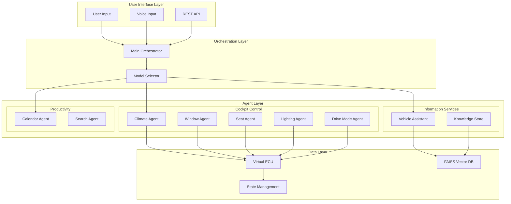
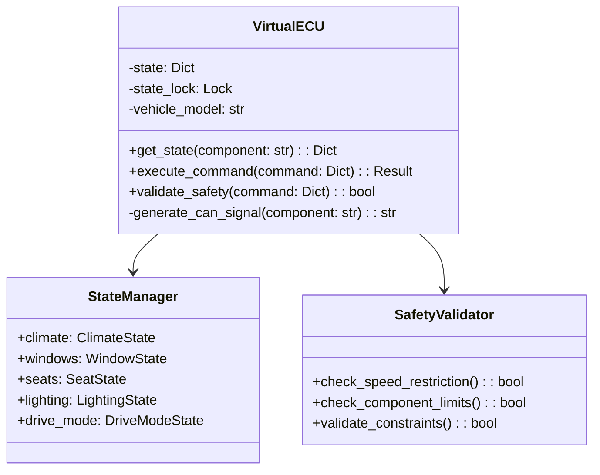

# Agent Architecture

## Overview

This document describes the multi-agent architecture designed for edge-deployed automotive AI systems powered by Qwen3-1.7B. The architecture emphasizes modularity, safety, and efficient resource utilization while maintaining offline capabilities with advanced reasoning.

## System Architecture



## Core Components

### Qwen3-1.7B Capabilities

The system leverages Qwen3-1.7B for advanced AI reasoning:

| Feature | Capability | Benefit |
|---------|------------|----------|
| Structured Output | Complex reasoning with structured generation | Enhanced problem-solving for vehicle diagnostics |
| Extended Context | Large conversation memory | Maintains context across long interactions |
| Multilingual | Multiple language support | Global vehicle deployment capabilities |
| Open Source | Compatible licensing | Enterprise-friendly deployment |
| Edge Optimized | 1.7B parameters | Efficient inference on automotive hardware |

### 1. Orchestration Layer

| Component | Purpose | Key Features |
|-----------|---------|--------------|
| Main Orchestrator | Routes user requests to appropriate agents | Qwen3 advanced reasoning, Extended context management, Multi-turn conversation support |
| Model Selector | Dynamically chooses between Qwen3 local and cloud models | Query complexity analysis, Resource-aware routing, Adaptive processing |

### 2. Agent Categories

#### Cockpit Control Agents
Direct vehicle system control through natural language commands.

| Agent | Functionality | Safety Features |
|-------|--------------|-----------------|
| Climate Control | Temperature, fan speed, AC/heat management | Temperature limits (60-85°F), Gradual adjustments |
| Window Control | Individual and group window operations | Speed-based restrictions, Child lock integration |
| Seat Control | Position, heating/cooling, memory functions | No adjustment while driving (>5 mph) |
| Lighting Control | Interior/exterior lighting management | Automatic safety modes |
| Drive Mode | Sport/Eco/Normal/Snow mode selection | Speed restrictions for mode changes |

#### Information Agents
Knowledge retrieval and documentation access.

| Agent | Data Source | Capabilities |
|-------|------------|--------------|
| Vehicle Assistant | FAISS vector database | Offline manual search, Advanced troubleshooting with Qwen3 reasoning, Intelligent maintenance scheduling |

#### Productivity Agents
Task and schedule management.

| Agent | Functions | Integration |
|-------|-----------|-------------|
| Calendar Assistant | CRUD operations for appointments | Time-aware scheduling, Conflict detection |
| Search Assistant | Web information retrieval | Current events, Weather data, Location services |

## Virtual ECU Implementation

The Virtual Electronic Control Unit (ECU) serves as the central state management system for all vehicle controls.

### Architecture



### State Structure

| Component | State Variables | Constraints |
|-----------|----------------|-------------|
| Climate | temperature_set, temperature_current, fan_speed, ac_on, mode | Temp: 60-85°F, Fan: 0-7 |
| Windows | driver, passenger, rear_left, rear_right, sunroof, child_lock | Position: 0-100%, Speed limits |
| Seats | position_forward, position_height, position_recline, heating, cooling | Forward: 0-100%, Heating: 0-3 |
| Lighting | headlights, fog_lights, interior_dome, ambient, reading | Various modes and intensities |
| Drive Mode | current, traction_control, stability_control, lane_assist | Mode change <5 mph |

### CAN Bus Signal Generation

The Virtual ECU generates realistic Controller Area Network (CAN) signals for automotive integration:

```python
# Example CAN signal format
{
    "id": "0x3B2",      # Message identifier
    "data": [01, 64],   # Data bytes
    "timestamp": 1234567890,
    "component": "window_control"
}
```

### Tool Decorator Pattern

All agents use the Strands SDK tool decorator for consistent interface:

```python
@tool
def agent_function(command: str) -> str:
    """
    Agent documentation
    
    Args:
        command: Natural language command
        
    Returns:
        Human-readable response with action taken
    """
    # Implementation
```

## Safety and Validation

### Safety Matrix

| Action | Speed Limit | Additional Checks |
|--------|------------|-------------------|
| Seat Adjustment | < 5 mph | Occupancy sensor |
| Drive Mode Change | < 5 mph | System stability |
| Window Operation | < 45 mph (50% max) | Child lock status |
| Traction Control Off | 0 mph | Driver confirmation |

### Validation Pipeline

1. **Input Validation**: Natural language parsing and intent extraction
2. **Safety Check**: Speed and state-based restrictions
3. **Constraint Validation**: Component-specific limits
4. **State Update**: Atomic, thread-safe operations
5. **Response Generation**: User feedback with CAN signals

## Performance Considerations

### Resource Optimization with Qwen3-1.7B

| Aspect | Strategy | Impact |
|--------|----------|--------|
| Memory | Qwen3-1.7B model optimization | 2-4GB total usage |
| CPU | Asynchronous processing | <10% idle usage |
| Storage | Pre-built FAISS indices + Qwen3 | 2.2GB model + 50MB vector store |
| Latency | Qwen3 local inference | <500ms response time |

### Scaling Strategies

- **Horizontal**: Multiple agent instances for parallel processing
- **Vertical**: Dynamic resource allocation based on load
- **Edge-First**: Qwen3 offline capabilities with cloud fallback
- **Adaptive Processing**: Automatic complexity detection for optimal resource use

## Testing Framework

### Test Categories

| Type | Coverage | Focus |
|------|----------|-------|
| Unit Tests | Individual agents | Function validation |
| Integration Tests | Agent interactions | Communication protocols |
| Safety Tests | ECU validation | Constraint enforcement |
| Performance Tests | System load | Resource utilization |

### Test Automation

```bash
pytest tests/test_cockpit_controls.py -m unit
pytest tests/test_integration.py -m integration
pytest tests/test_safety.py -m safety
```