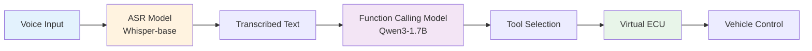
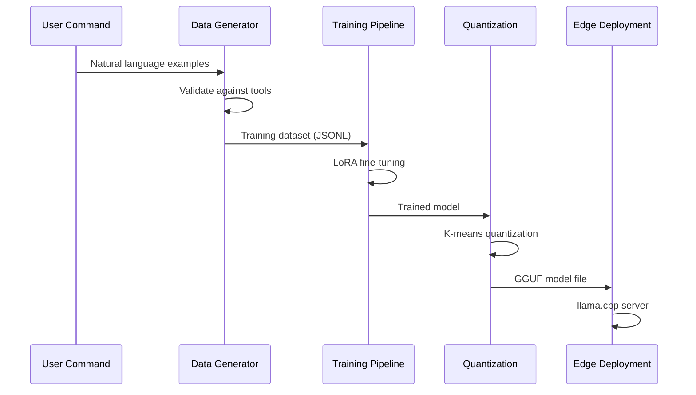
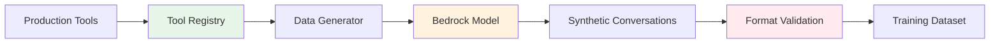
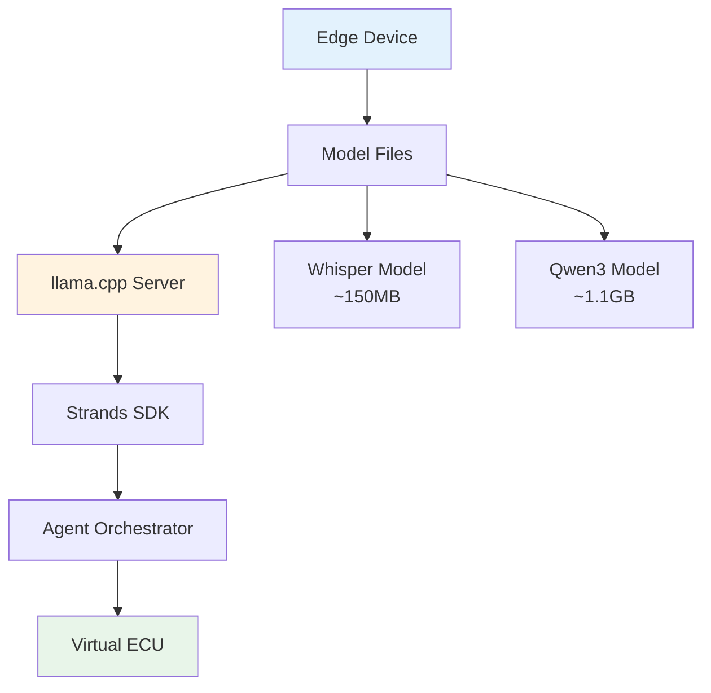

# Data Science Pipeline for Edge AI

This repository contains production-ready fine-tuning pipelines for multimodal edge AI deployment, enabling both voice interaction through automatic speech recognition and intelligent tool execution through function calling.

## Overview

The data science pipeline addresses two critical capabilities for edge AI systems: understanding spoken commands through ASR fine-tuning and executing actions through function calling fine-tuning. Both pipelines have been designed and tested for deployment on resource-constrained edge devices.

## System Architecture



## Pipeline Components

### Function Calling Fine-Tuning

The function calling pipeline fine-tunes Qwen3-1.7B for reliable tool execution in automotive edge environments. This implementation solves critical production challenges including tokenization mismatches and format alignment issues.

| Component | Description | Technology |
|-----------|-------------|------------|
| Base Model | Language model for tool calling | Qwen3-1.7B |
| Training Method | Parameter-efficient fine-tuning | LoRA (rank 16) |
| Data Generation | Synthetic conversation creation | AWS Bedrock |
| Quantization | Model compression for edge | Q4_K_M (4-bit) |
| Deployment Format | Optimized inference format | GGUF |

### Automatic Speech Recognition Fine-Tuning

The ASR pipeline adapts OpenAI's Whisper model for specialized language support, with particular focus on continuous-script languages like Japanese.

| Component | Description | Technology |
|-----------|-------------|------------|
| Base Model | Multilingual speech recognition | Whisper-base (74M) |
| Training Method | Efficient adaptation | LoRA |
| Dataset | Speech samples | Mozilla Common Voice |
| Optimization | Memory efficiency | Gradient checkpointing |
| Precision | Numerical stability | BF16 mixed precision |

## Training Process Flow



## Technical Implementation

### Data Generation and Validation

The function calling pipeline includes a sophisticated data generation system:



### Model Quantization and Export

Post-training optimization prepares models for edge deployment:

| Method | Size Reduction | Quality Preserved | Use Case |
|--------|---------------|-------------------|----------|
| Q4_K_M | ~70% | High | Standard edge deployment |
| Q8_0 | ~50% | Very High | Performance-critical |
| IQ4_XS | ~75% | Good | Extreme resource constraints |

## Production Deployment

### Supported Vehicle Controls

The system implements five production-ready control tools:

| Tool | Function | Safety Constraints |
|------|----------|-------------------|
| climate_control | Temperature, AC, defrost | 60-85°F limits |
| window_control | Windows, sunroof | No operation >45mph |
| seat_control | Position, heating/cooling | No adjustment >5mph |
| lighting_control | Headlights, ambient | Auto-activation at dusk |
| drive_mode | Sport/eco/comfort | Stationary only |

### Deployment Architecture



## Directory Structure

```
data_science_pipeline/
├── function_calling_fine_tuning.ipynb  # Tool calling training
├── asr_fine_tuning.ipynb              # Speech recognition training
├── utils/
│   └── data_generator.py              # Synthetic data creation
└── data/
    ├── train.jsonl                     # Training examples
    └── test.jsonl                      # Evaluation examples
```

Complete documentation and examples are available in the individual notebooks, which include step-by-step instructions and explanations of key concepts.
